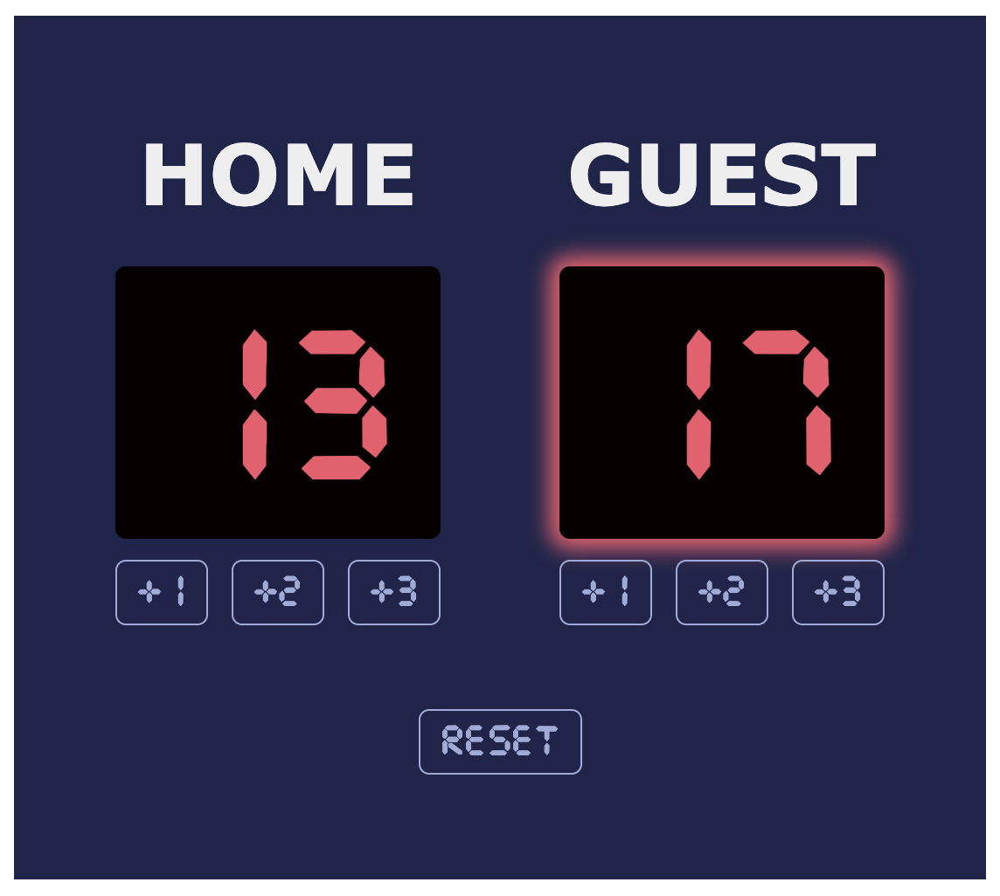

# Basketball Scoreboard

A simple, interactive basketball scoreboard web application made for the Scrimba front-end developer course.

## Features

- Track scores for home and guest teams
- Increment scores by 1, 2, or 3 points
- Visual highlight for the leading team
- Reset button to start a new game

## Technologies Used

- HTML
- CSS
- JavaScript

## How It Works

The scoreboard displays two columns, one for the home team and one for the guest team. Each team has a score display and three buttons to add points (+1, +2, +3). The current leader's score is highlighted with a red glow. A reset button at the bottom allows you to start a new game.

## Usage

1. Open `index.html` in a web browser
2. Click the +1, +2, or +3 buttons to update scores
3. The leading team's score will be highlighted
4. Click "Reset" to start a new game

## Files

- `index.html`: The main HTML structure
- `index.css`: Styles for the scoreboard
- `index.js`: JavaScript for scoreboard functionality
- `fonts/CursedTimerUlil-Aznm.ttf`: Custom font for the score display